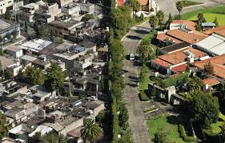

# Tarea 01 - Danitza Sandrock
### 1. Electromovilidad en Chile

**Pros:**

- **Es un Tema del Momento:** La electromovilidad está en boca de todos, especialmente con las políticas del gobierno y el interés por reducir la huella de carbono.
- **Innovación en Crecimiento:** Es un área que está despegando, así que hay mucho material reciente y fresco por explorar.

**Contras:**

- **No es para Todos:** No todo el mundo puede comprarse un auto eléctrico, así que quizás no todos se sientan identificados con el tema. Además, su impacto se siente más en las ciudades y en ciertos grupos sociales, así que no llega a toda la gente.
- **Datos Difíciles de Encontrar:** Puede ser un reto conseguir información específica para hacer un análisis profundo. Aunque podríamos centrarnos en iniciativas públicas, estadísticas de ventas de autos eléctricos y estudios de impacto ambiental, esto requerirá un gran esfuerzo.

### 2. Burbuja Inmobiliaria en una Comuna Específica de la Capital

**Pros:**

- **Impacto Social:** Es un tema que afecta directamente a las generaciones jóvenes que sueñan con tener su propia casa.
- **Hay Información Disponible:** Seguramente existen estudios y estadísticas sobre la especulación inmobiliaria, precios de viviendas y urbanización.
- **Enfoque Local:** Al centrarnos en una comuna específica, el análisis puede ser más detallado y relevante para la gente que vive allí.

**Contras:**

- **Es Complejo:** Necesita un análisis profundo y probablemente consultar muchos estudios técnicos y proyectos a futuro.
- **Alcance Limitado:** Si solo nos enfocamos en una comuna, puede ser restrictivo, pero si ampliamos el tema a más áreas, podría volverse muy extenso.
- **Puede Parecer Aburrido:** Si no se presenta de manera interesante, puede parecer un tema demasiado especializado y no captar la atención de un público más amplio.

### 3. Pérdida de Diversidad de Fauna en Santiago

**Pros:**

- **Conciencia Ambiental:** Este tema puede atraer a personas interesadas en la conservación y el medio ambiente.
- **Interés Local:** La fauna y flora locales pueden despertar un gran interés entre los santiaguinos.
- **Oportunidades Visuales:** Ofrece muchas posibilidades para crear historias visuales impactantes y emocionales.

**Contras:**

- **Poco Conocido:** Puede que haya poca conciencia sobre la diversidad de fauna en Santiago, así que habría que hacer un esfuerzo extra para educar al público.
- **Datos Escasos:** La información sobre la fauna de ciertas áreas (como el río Mapocho) y su deterioro puede ser limitada o difícil de conseguir.
### 4. Segregación Urbana Basada en Áreas Verdes

**Pros:**
- **Tema Importante:** La segregación urbana es un tema relevante, especialmente en cuanto a calidad de vida y justicia social.
- **Datos Claros:** Seguramente hay estudios y datos sobre la distribución de áreas verdes en las comunas de Santiago.
- **Impacto Visual:** Mapas y gráficos que muestren la segregación por áreas verdes pueden ser muy efectivos para visualizar el problema.

**Contras:**

- **Análisis Complejo:** Requiere un enfoque que mezcle urbanismo, sociología y geografía.
- **Tema Delicado:** Podría tocar fibras sensibles, especialmente al hablar de desigualdad social y económica.
- **Enfoque Limitado:** Dependiendo del área en la que nos enfoquemos (educación, economía, urbanismo, etc.), podríamos dejar de lado otras facetas importantes de la segregación urbana si solo nos centramos en las áreas verdes.
### Conclusiones de Miro
Según el gráfico de impacto y esfuerzo del tablero de Miro:

- **Segregación Urbana:** Es el tema con mayor impacto, pero también el que más trabajo requiere. Sin embargo, podría generar contenido muy poderoso, aunque exigente en términos de investigación y análisis.
  
- **Burbuja Inmobiliaria:** Es un buen equilibrio entre impacto y esfuerzo, lo que lo hace viable y relevante, sobre todo para los jóvenes.
  
- **Pérdida de Diversidad de Fauna:** Es un tema con menos impacto, pero que requiere menos esfuerzo, ideal si se busca un enfoque ambiental sin tanta complicación.
  
- **Electromovilidad:** Aunque tiene potencial, está en un rango de menor impacto y necesita bastante esfuerzo, lo que podría limitar su efectividad como tema central.

[link del miro](https://miro.com/welcomeonboard/WFU1bXR3VkhibHVYUGlLVFVzYVU0OVozb0wzRzg0cmNzZXowYzlDUXEyaGFlcDJNbG05R2h1bTNjS2NxUUg0MXwzNDU4NzY0NTU5NzAxNzM2NjAwfDI=?share_link_id=289937459786)